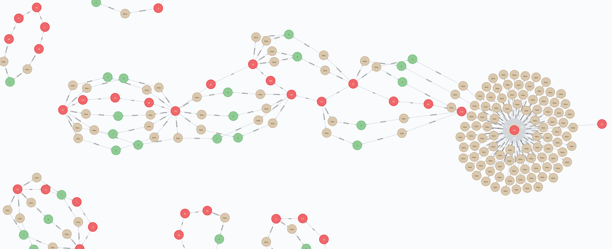

# A Basic Bitcoin Block Explorer Built in Python

This is a project still in the developing phase.

This is project aims to be a Bitcoin block explorer with an API which is going to be used by the Blockchain project repository, specifically for the Bitcoin Wallet.

## Description

The Bitcoin blockchain is stored on binary files which include a certain number of blocks. Each block contains transactions, which also contains the Bitcoins. In this way, the blockchain knows how many bitcoins are available and how they can be spent. However, due to space efficiency reasons, the blockchain can't be queried directly since it is compact binary information concatenated together. 

In order for somebody to interprete these binary files, it is necessary to decode these files into transactions, and blocks, according to the guidelines offered by the Bitcoin-core project https://en.bitcoin.it/wiki/Protocol_documentation.

In this order of ideas, this project decodes these binary files of the blockchain locally, and then creates a graph database that stores the whole interpreted blockchain. The purpose of this transition, is to be able to query the blockchain to build and validate transactions, retrieve balances from different addresses or wallets, etc.

After, the blockchain is totally parsed into a graph database, we can serve this database to be queried by any client with the credentials to query the blockchain.

## Technical General Context

1. This project relies on a Full Bitcoin Node to operate. This project is being implemented on Raspberry Pies to run the full node, and also to decode and store the blockchain into a graph database.

2. This project needs a considerable amount of computing resources in order to conduct the blockchain parsing in a timely manner. This is why a Raspberry Pi cluster is being implemented to carry out this parsing in order to take advantage of multiprocessing, multithreading, and concurrency for efficiency purposes.

3. The type of database used in this project is a graph database called Neo4j. The reason for this selection is that a graph database is a natural fit for this project since the atomic unit of the blockchain and the graph databse is the transaction.

## Requirements

- Bitcoin full node.
- Neo4j graph database engine.
- Neo4j python driver ```pip install neo4j```
- 4 Terabytes of free space.
- blockcypher ```pip3 install blockcypher```

# Technical Details

- This project can rely on multiple computing units such as Raspberry Pies to parse chunks of the blockchain concurrently using multiprocessing. Python doesn't allow multiprocessing natively, which is why the parser needs to be called from outside n amount of times (n being the amount of cores of the computing unit). In this way, every time the process starts, it will do in a different core of the computing unit allowing multiprocessing. Also, this can be done in a single computing unit, but this will mean a slower parsing process.

- Multithreading is used in this project to speed up the process. Multithreading happens to avoid the python code to remain idle while waiting for the graph database to create the transactions that it was given. In this way, the python code will keep working on a thread while the graph databse will work on anotherone. 

- File-cursor is an important aspect in this project. Since it is possible, for technical or non-technical reasons, that the code will stop working abruptly, it is important to keep track of where, in the binary file, the parser stopped working. This way, next time the project starts parsing, it will pick up where it stopped last time, avoiding parsing twice transactions that had been already parsed. For this reason, this project contains a folder named "cursors" that stores the plain text files that contains where the parser is at the moment. This part of the code was developed from scratch.

- Logging is also important to trace errors. This project uses the Python native logging library using rotation to save space on disk.

- The graph database will create the following nodes: blocks, transactions, addresses, transaction-outputs (UTXOs).

## How to use

### Before starting

Before starting, please setup the cluster with a file-share sytem:

https://medium.com/@glmdev/building-a-raspberry-pi-cluster-784f0df9afbd

https://magpi.raspberrypi.org/articles/build-a-raspberry-pi-cluster-computer

### Setting up the parser

First make sure the Neo4j database is running on your computer which is going to host the graph database:

``` 
cd <new4j/path>/bin>
./neo4j start
```

Make sure you have enough space for the blockchain. Also, make sure that Neo4j *data* is pointing to the right place to store the blockchain (your SD card, for example).

Now, just wait a couple minutes while the server is up and running. To verify when it is running, simply go to a browser and go to the domain *localhost:7474*. Depending on the size of the blockchain, this can take several minutes (15min+)

Meanwhile, go to the raspberry pies. Make sure you are logged in on all of them. Now, let's share the files from the bitcoin node. 

In the raspberry pi that holds the bitcoin node, export the folders *bitcoin* and *block_explorer* like this (this is assuming you have already setup the exporting/importing process for file-share system in the local network. More details on this comming soon for the documentation. For now, visit ):

```
sudo exportfs -a
```

And that's it for the bitcoin node. Go to each one of the other raspberry pies and repeat the same following process to access the *bitcoin* and the *bock_explorer* folder:

```
sudo mount 10.0.0.248:/home/bitcoin_node_serna/Documents/block_explorer ~/Documents/block_explorer 
sudo chown nobody.nogroup ~/Documents/block_explorer
sudo chmod -R 777 ~/Documents/block_explorer
sudo mount 10.0.0.248:/home/bitcoin_node_serna/.bitcoin ~/bitcoin
cd ~/Documents/block_explorer
```

Change \<10.0.0.248\> for the ip of your bitcoin node in the local network. Also change \</home/bitcoin_node_serna/Documents/block_explorer\> and \<~/Documents/block_explorer\> for the actual directory inside your bitcoin node for the folders *bitcoin* and *block_explorer*. If you don't have a folder called *Documents* on your home directories inside your raspberry pies that are not the node, simply create one ``` mkdir ~/Documents ``` and then repeat the process if necessary.

Now, take a look to the ip address of the server. For mac, just do ```ifconfig```. Open the file *parser.py* in the *block_explorer* folder inside your bitcoin node or any other raspberry pi. Replace the ip address (keep the port ':7687') in the method *manager()* with the ip address of the server (your computer).

It is time to start the parser on each raspberry pi. Number each one of them starting from 1. Then, depending on the number you assigned them, run the following line in the terminal of each raspberry pi:

```sudo nohup bash node_parser <n> &  ```

*replace '\<n\>' with the number you assigned to each raspberry pi (1-4)

Tip: Since we are using *nohup* for the parser, a useful tool you can use to monitor the activity of your raspberry pi is ```htop```.

This process can take several weeks to complete. Once it is finished. It is time to add the height for the blocks:

``` sudo python3 add_height_script ```

If you have to stop the process of adding height to the blocks for some reason, and want to pick up where you stopped, the script *add_height_script* has an option to pass the id of the block where you want to pick up the work from:

``` sudo python3 add_height_script -b <block_id> ``` or its long version: ``` sudo python3 add_height_script --block_id <block_id>  ```

*Note: replace the \<block_id\> for the actual id of the block.*

After adding the height to the whole block chain, it is necessary to stay listenning for new coming blocks. To do this, check out the folder *cursors* in the directory *block_explorer*. Look for the highest index of those files (exclude the leading zeros). And then:

``` sudo python3 single_core_parser  <highest_index>  1```

*Note: replace the \<highest_index\> for the actual index you found to be the highest among the cursor files.*

This should activate the *continous* mode of the parser. This last step will add the height of the latest blocks, and will process automatically every block as it comes. This will also deal with stale blocks live.

That's it!

This is how chunks of the blockchain looks like in a graph database:


 

- Red nodes: blocks
- Brown nodes: transactions
- Green nodes: UTXOs (bitcoins)


